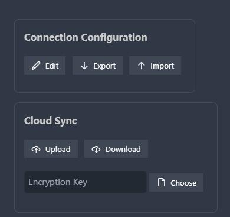

# Console

By clicking this button to open the console, where you can modify extension settings, export and import config.

## Options

There are two types of settings provided here, advanced settings are only available to paid users.

## Cloud Sync

To synchronize your connection information through the cloud.

You can specify an encryption key, which will be used for DES encryption and decryption during synchronization to ensure your data security.

