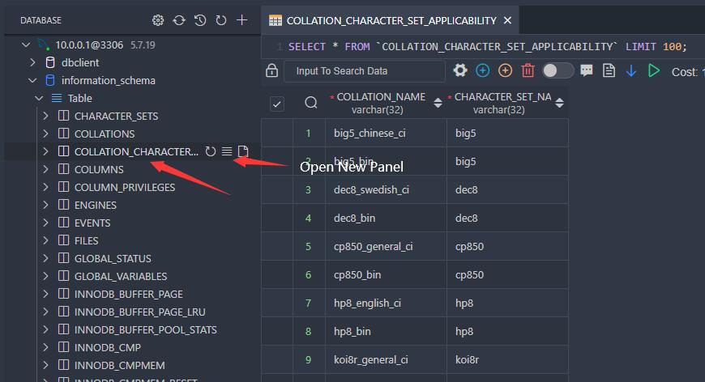
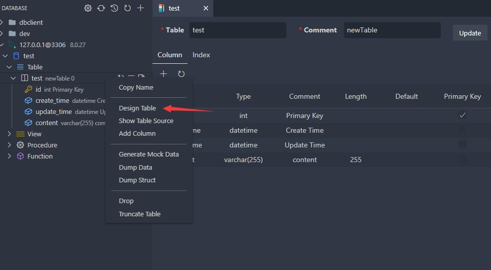
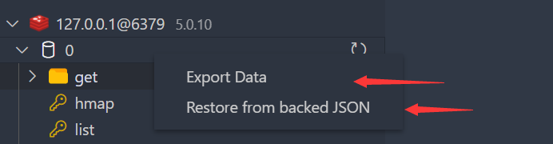

# Database

## View

1. View Data:

   1. Single Panel: Click table node.
   2. New Panel: Click button beside table
2. Then you can do data modification on the table view.

## Execute SQL

In the Database Explorer panel, click the `Open Query` button.

That will open a SQL editor bind of database, it provider:

1. IntelliSense SQL edit.
2. snippets:`sel、del、ins、upd、joi, selc`...
3. Run selected or current cursor SQL (Shortcut : Ctrl+Enter).
4. Run all SQL (Shortcut : Ctrl+Shift+Enter).

## Design

There are two ways to modify table meta information

1. Right-click on the table, select Design Table, you can open the design table interface to view the columns and indexes of the table (currently only MySQL has high support)
2. Expand the table node directly, click the column node and edit it directly by SQL.

## Backup/Import

### SQL

Right-click on a table or database node, and you can backup and restore data through the menu.

The extension has a built-in backup function, but it is not perfect. When your environment variable has **mysql_dump** or **pg_dump**, the extension will use These tools make backups.

### Redis

Since version 5.0, Redis backup and restore is supported, in the format of JSON file customized by this program.

## Mock Data

Quickly generate data for database testing, generate by following steps:

Generate Config

- mockStartIndex: Used to populate the primary key, auto means to take the total number of current table data + 1.
- mockCount: The total number of test data you want to generate
