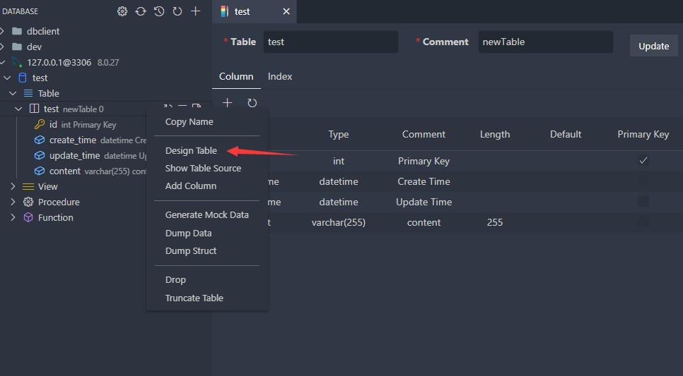
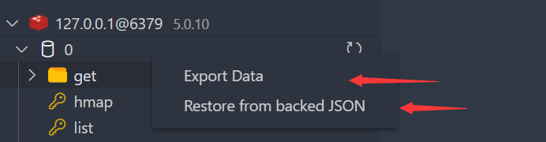
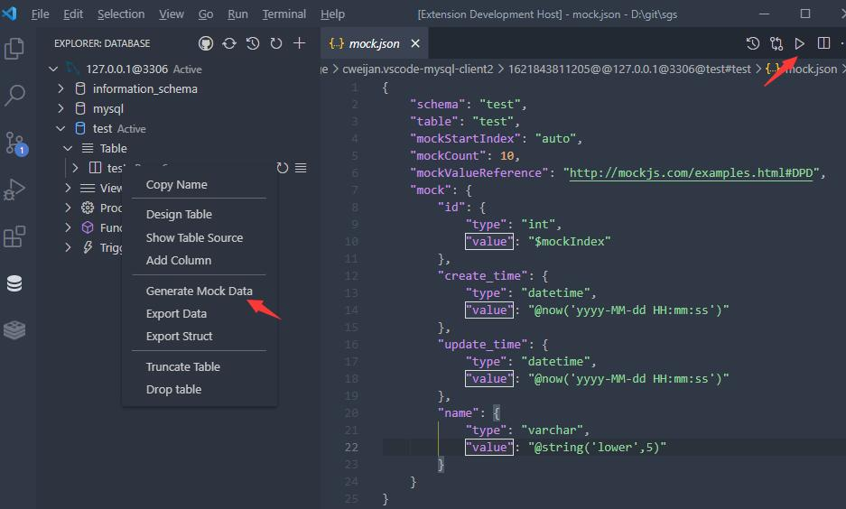

# 数据库

## 浏览

1. 点击数据库表打开数据页, 点击表旁边的按钮则是打开新的数据页.
2. 之后就可在页面进行CRUD、数据导出等操作..

## 执行SQL

点击数据库节点的 `Open Query` 按钮.

将会打开和当前数据库绑定的SQL编辑器, 提供以下功能

1. SQL自动补全.
2. snippets: `sel、del、ins、upd、joi, selc.`
3. 执行已选择或当前光标SQL (快捷键: Ctrl+Enter).
4. 执行全部SQL (快捷键: Ctrl+Shift+Enter).

## 设计表

修改表元信息有两种做法

1. 对表右键, 选择Design Table(设计表), 就可打开设计表界面查看表的列和索引 (目前只有MySQL得到较高的支持)
2. 直接展开表节点, 点击列节点后通过SQL直接编辑.

## 备份/恢复

### SQL

在表或者数据库节点右击, 就可通过菜单进行数据的备份恢复. 扩展内置了备份功能, 但不够完善, 当你的环境变量具有**mysql_dump**或**pg_dump**, 扩展将会使用这些工具进行备份.

### Redis

从版本5.0开始支持对Redis进行备份和恢复, 格式为本程序自定义的JSON文件.

## Mock数据

快速生成用于测试的数据, 通过以下步骤进行生成:

生成配置文件

- mockStartIndex: 用于填充主键, auto表示取当前的表数据总数+1.
- mockCount: 想要生成的测试数据总数
