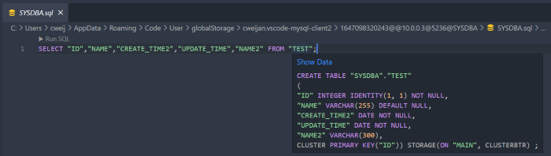
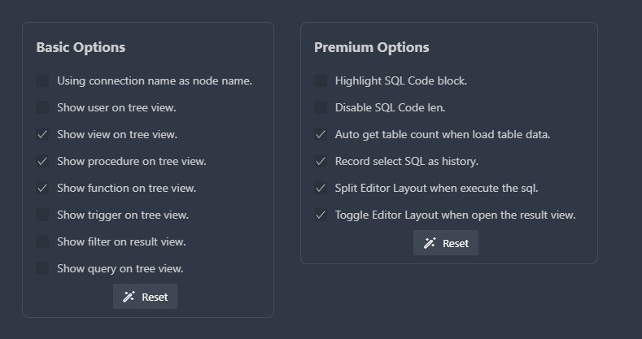

# 辅助

## 复制行

鼠标移动到要复制的行, 右键打开菜单, 选择Open Copy Dialog

## 表定义

当你将鼠标移动到表的上面时, 可以显示表的创建语句, 或者使用alt+enter快捷键通过Code Action的方式操作(即DDL, 只支持非隐藏表)

## 控制台

通过点击这个按钮打开控制台, 可在控制台内修改扩展设置, 导出导入设置, 和进行连接设置云同步.

### 设置

这里提供了两种设置类型, 高级设置只对付费用户开放.

### 云同步

通过云端同步你的连接信息, 可以指定一个加密密钥, 在同步时会通过该密钥进行DES加解密, 确保数据安全.

## Mock数据

快速生成用于测试的数据, 通过以下步骤进行生成:

生成配置文件

- mockStartIndex: 用于填充主键, auto表示取当前的表数据总数+1.
- mockCount: 想要生成的测试数据总数
