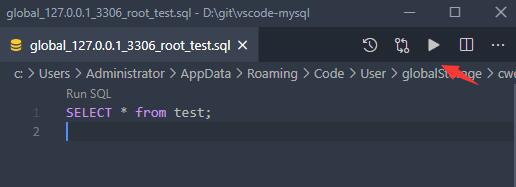
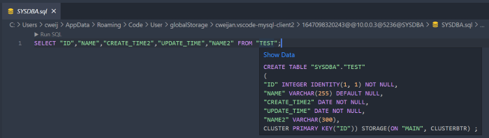

# SQL

## Execute

In the Database Explorer panel, click the `Open Query` button.

That will open a SQL editor bind of database, it provider:

1. IntelliSense SQL edit.
2. snippets:`sel、del、ins、upd、joi, selc`...
3. Run selected or current cursor SQL (Shortcut : Ctrl+Enter).
4. Run all SQL (Shortcut : Ctrl+Shift+Enter).

## Table Definition

When you move the mouse over the table, the table creation SQL can be displayed, or use the alt+enter shortcut to operate through Code Action (only non-hidden tables can be supported)

